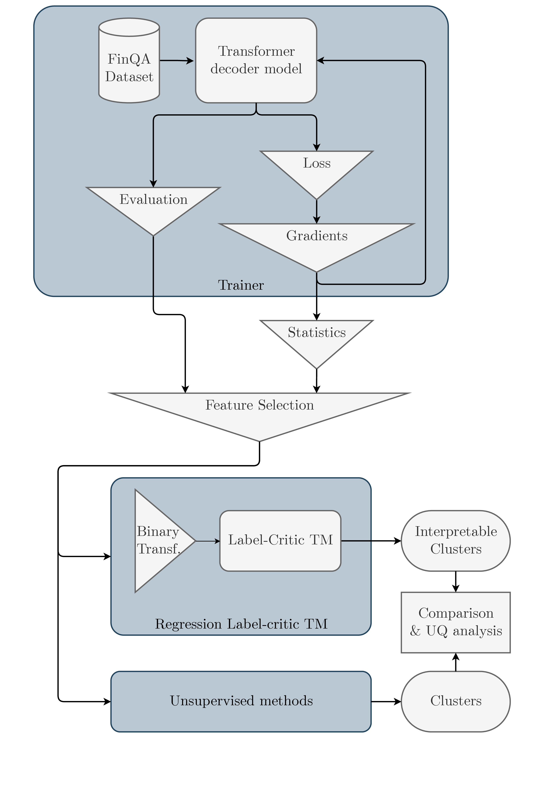
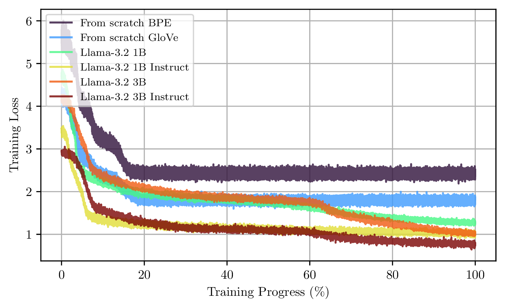
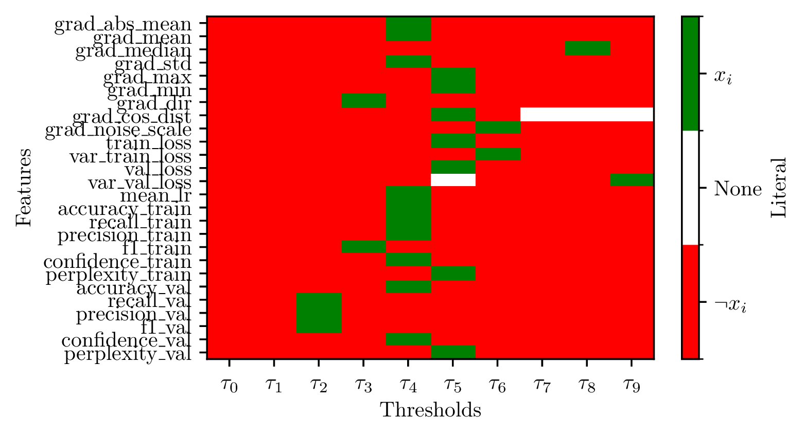

# Language Model Uncertainty Quantification with Tsetlin Machine

<a id="readme-top"></a>

<!-- TABLE OF CONTENTS -->
<!-- <details>
  <summary>Table of Contents</summary>
  <ol>
    <li>
      <a href="#project-summary">Project Summary</a>
    </li>
    <li>
      <a href="#components">Components</a>
      <ul>
        <a href="#1-finllm-training"> FinLLM Training</a>
        <ul>
          <li><a href="#dataset">Dataset</a></li>
          <li><a href="#models">Models</a></li>
          <li><a href="#purpose">Purpose</a></li>
        </ul>
      </ul>
      <ul>
        <a href="#2-symbolic-clustering-of-training-dynamics-uncertainty-modeling">2. Symbolic Clustering of Training Dynamics (Uncertainty Modeling)</a>
        <ul>
          <li><a href="#feature-extraction">Feature Extraction</a></li>
          <li><a href="#feature-binarization">Feature Binarization</a></li>
          <li><a href="#regression-label-critic-tsetlin-machine-reglctm">Regression Label-Critic Tsetlin Machine (RegLCTM)</a></li>
          <li><a href="#interpretability">Interpretability</a></li>
        </ul>
      </ul>
      <li>
        <a href="#getting-started">Getting Started</a>
        <ul>
          <li><a href="#built-with">Built With</a></li>
          <li><a href="#prerequisites">Prerequisites</a></li>
          <li><a href="#installation">Installation</a></li>
        </ul>
      </li>
      <li>
        <a href="#usage">Usage</a>
        <ul>
          <li><a href="#training-the-finllm">Training the FinLLM</a></li>
          <li><a href="#running-symbolic-clustering-reglctm">Running Symbolic Clustering (RegLCTM)</a></li>
          <li><a href="#interpreting-results">Interpreting Results</a></li>
        </ul>
      </li>
      <li><a href="#references">References</a></li>
      <li><a href="#citation-and-acknowledgements">Citation and Acknowledgements</a></li>
      <li><a href="#license">License</a></li>
      <li><a href="#contact">Contact</a></li>
    </li>
  </ol>
</details> -->

## Project Summary

This project studies *epistemic uncertainty* in financial large language models (FinLLMs) by analyzing their training dynamics.  We focus on LLMs fine-tuned on the FinQA dataset [[1]](#references), a financial question-answering benchmark requiring multi-step numerical reasoning.  The goal is to make training-time uncertainty *interpretable* and *diagnosable*. To this end, we propose a framework that extracts gradient-based features during LLM training and uses a symbolic model (the Regression Label-Critic Tsetlin Machine, or RegLCTM) to cluster training steps into human-readable uncertainty regimes.  Intuitively, changes in the model’s predictive entropy during training are linked to the gradients of the loss, and our pipeline (see figure below or Figure 4.1 in the thesis) collects statistics like gradient norms and losses over epochs and feeds them into RegLCTM. The outcome is a set of clause-based clusters that group similar uncertainty behaviors together. This two-part approach addresses the challenge of understanding *when* and *why* a FinLLM is uncertain, by combining powerful data-driven models (LLMs) with transparent rule-based analysis (Tsetlin Machines).


<div align="center">
  
</div>


## Table of Contents

- [Project Summary](#project-summary)
- [Components](#components)
  - [1. FinLLM Training](#1-finllm-training)
    - [Dataset](#dataset)
    - [Models](#models)
    - [Purpose](#purpose)
  - [2. Symbolic Clustering of Training Dynamics (Uncertainty Modeling)](#2-symbolic-clustering-of-training-dynamics-uncertainty-modeling)
    - [Feature Extraction](#feature-extraction)
    - [Feature Binarization](#feature-binarization)
    - [Regression Label-Critic Tsetlin Machine (RegLCTM)](#regression-label-critic-tsetlin-machine-reglctm)
    - [Interpretability](#interpretability)
- [Getting Started](#getting-started)
  - [Built With](#built-with)
  - [Prerequisites](#prerequisites)
  - [Installation](#installation)
- [Usage](#usage)
  - [Training the FinLLM](#training-the-finllm)
  - [Running Symbolic Clustering (RegLCTM)](#running-symbolic-clustering-reglctm)
  - [Interpreting Results](#interpreting-results)
- [Future Work / Roadmap](#future-work--roadmap)
- [References](#references)
- [Citation and Acknowledgements](#citation-and-acknowledgements)
- [License](#license)
- [Contact](#contact)


<!-- CONTACT -->

<!-- <p align="right">(<a href="#readme-top">back to top</a>)</p> -->


<!-- ACKNOWLEDGMENTS -->
<!-- ## Acknowledgments -->

<!-- Use this space to list resources you find helpful and would like to give credit to. I've included a few of my favorites to kick things off!

* [Choose an Open Source License](https://choosealicense.com)
* [GitHub Emoji Cheat Sheet](https://www.webpagefx.com/tools/emoji-cheat-sheet)
* [Malven's Flexbox Cheatsheet](https://flexbox.malven.co/)
* [Malven's Grid Cheatsheet](https://grid.malven.co/)
* [Img Shields](https://shields.io)
* [GitHub Pages](https://pages.github.com)
* [Font Awesome](https://fontawesome.com)
* [React Icons](https://react-icons.github.io/react-icons/search) -->

<!-- <p align="right">(<a href="#readme-top">back to top</a>)</p> -->


<!-- ## Description

This project is a Python implementation of an LLM Uncertainty Quantification with Tsetlin Machine in the context of financial risk management. The idea is to use the LLM training to generate synthetic data and use it to train a Tsetlin Machine to predict the uncertainty of the LLM model. 

The design of the LLM is based on the Transformer-decoder architecture. The Tsetlin Machine is a propositional logic-based machine learning algorithm that can be used to predict the uncertainty of the LLM model. Here, we use a Regression Label-Critic Tsetlin Machine to predict the uncertainty of the LLM model. The approach is novel as the Regression Label-Critic Tsetlin Machine that we develop is the first of its kind to predict the uncertainty of a Transformer-decoder model. The Regression Tsetlin Machine emerged from [Granmo, Ole-Christoffer (2018)](https://royalsocietypublishing.org/doi/10.1098/rsta.2019.0165) where as the Label-Critic Tsetlin Machine emerged from [Abouzeid et al. (202Z)](https://ieeexplore.ieee.org/document/9923796).

The project is divided into two main parts: the LLM training and the Tsetlin Machine training. The LLM training is done using the Pytorch library. The Tsetlin Machine training is done using the Tsetlin Machine library and [this](https://github.com/Ahmed-Abouzeid/Label-Critic-TM/tree/main) repository. The project is designed to be run on a High-Performance Computing (HPC) cluster using the Slurm job scheduler.

The image bellow shows the workflow of the project.


More details coming soon.-->


## Components

### 1. FinLLM Training

* **Dataset:** We use **FinQA** [[1]](#references), an 8,281-pair dataset of financial QA problems. Each example combines text and tables from earnings reports, requiring deep numerical and logical reasoning.
* **Models:** We train two families of FinLLMs:

  * *From-scratch Transformers:* Custom decoder-only models (6–16 layers) trained solely on FinQA. We experiment with two tokenization schemes: 
    * one using pretrained **GloVe** embeddings [[4]](#references),
    * one using **Byte-Pair Encoding (BPE)** embeddings [[5]](#references).
  * *Pretrained Llama-3.2 Models:* We fine-tune Meta’s Llama 3.2 family (1B and 3B parameters) on FinQA. For each size, we include both the base model and an instruction-tuned variant. Using pretrained LLMs leverages transfer learning for improved performance on the financial domain.
* **Purpose:** This component produces FinLLMs that solve FinQA tasks. It is aimed at NLP and AI researchers working on finance – providing a foundation for uncertainty analysis.  Details of model architectures and hyperparameters are in the thesis’s experimental setup.

### 2. Symbolic Clustering of Training Dynamics (Uncertainty Modeling)

* **Feature Extraction:** During FinLLM training, we record gradient statistics and evaluation metrics at each training step (batch/epoch). These include e.g. gradient means, absolute means, loss changes, etc. The theory shows that gradients are related to the model’s predictive entropy (uncertainty), so they serve as proxies for epistemic uncertainty.
* **Feature Binarization:** Continuous gradient features are binarized using thresholding (developed in the thesis document). This produces a binary dataset where each feature indicates whether a gradient statistic crosses a certain threshold.
* **Regression Label-Critic Tsetlin Machine (RegLCTM):** We feed the binarized features into a RegLCTM. RegLCTM is a hybrid Tsetlin Machine that combines: (1) a *Regression TM* [[2]](#references) to handle continuous inputs, and (2) a *Label-Critic TM* [[3]](#references)  that learns clauses in a self-supervised way.  The result is a set of logical clauses that define each cluster of epochs/batches. In effect, RegLCTM clusters training steps into interpretable “uncertainty regimes”. Each cluster corresponds to a combination of gradient patterns (e.g. “gradient mean low AND gradient max high”).
* **Interpretability:** The key outcome is that each cluster is defined by human-readable rules (logical clauses). Researchers in symbolic AI or uncertainty quantification can inspect these clauses to understand how the training process evolves (e.g. “During Epochs 5–10, the model’s uncertainty decreases as loss gradients shrink” could be one cluster’s interpretation). Thus this component makes FinLLM uncertainty transparent.

An overview of the full pipeline is shown in Figure 4.1 of the thesis. The top part trains the FinLLM on FinQA (feeding data into the Transformer model). The side branches compute evaluation metrics and gradient statistics. These outputs are combined and passed to RegLCTM, which generates the interpretable clusters (right side of flowchart).


## Getting Started

### Built With


<p align="center">
  <a href="https://skillicons.dev">
    
  </a>
</p>
<p align="center">
  
	
	
    
  </a>
</p>

* [pyTsetlinMachine](https://github.com/cair/pyTsetlinMachine)

### Prerequisites

**Environment:** We recommend Python 3.10+ with GPU support. Required libraries include PyTorch (for LLM training), Hugging Face Transformers (for pretrained models), and the Tsetlin Machine library (`tmu`) for RegLCTM.

### Installation

1. Clone the repo
   ```sh
   git clone git@github.com:art-test-stack/LLM-UQ-with-TM.git
   ```
2. Create a Python virtual environment and run it.
3. Install Python packages
   ```sh
   pip install -r requirements.txt
   ```
4. Download GloVe embeddings:
    ```sh
    cd glove
    wget https://nlp.stanford.edu/data/glove.840B.300d.zip
    unzip glove.840B.300d.zip
    ```

> [!NOTE]  
> FinQA dataset is automatically downloaded from HuggingFace dataset library when running the training script.

### Adapt Settings:

1. Edit the [`.env`](.env) file, according to the example [`example.env`](example.env) file, to update the variables with the correct paths and settings. Then run the 'source' command to load the variables.
    ```sh
    source .env
    ```
2. Edit the `config` folder files, such as `config/finllm_config.yaml`, to set paths and hyperparameters (like batch size, learning rate). Placeholders in scripts should be replaced with your environment paths, number of epochs, etc.
Config files include:
  - `model`:
    - `type`: Type of model to train: `torch` (for from-scratch models)     or `hgface` (for models from Hugging Face Transformers).
    - `name` (optional): Name of the model to train (e.g. `llama-3.2-3B`).
    - `base_model` (for Hugging Face Transformers models only): Base model to use for training. (e.g. `meta-llama/Llama-3.2-7B`).
    - `tokenizer` (optional): Tokenizer to use for the model. If not set, the default tokenizer for the model type will be used.
    - `special_tokens` (optional): Special tokens to use for the model. If not set, the default special tokens for the model type will be used. Must be specified for Hugging Face Transformers models. Look at [`special_tokens.py`](llm/data/special_tokens.py) to see the available special tokens in `SpecialTokens` class.
    - `lora` (optional): If set, the model will be trained with LoRA (Low-Rank Adaptation) for efficient fine-tuning. Works with [PEFT](https://huggingface.co/docs/peft/index) library. Parameters:
      - `r`: Rank of the LoRA layers.
      - `lora_alpha`: Scaling factor for the LoRA layers.
      - `lora_dropout`: Dropout rate for the LoRA layers.
      - `target_modules`: List of target modules to apply LoRA to (e.g. `['q_proj', 'v_proj']` for Llama models).
  - `training`:
    - `batch_size`: Batch size for training.
    - `test_batch_size`: Batch size for testing.
    - `epochs`: Number of epochs to train the model.
    - `optimizer`: Optimizer to use for training (e.g. `adamw`, `sgd`).
    - `loss_function`: Loss function to use for training (e.g. `cross_entropy`).
    - `learning_rate`: Learning rate for the optimizer.
    - `accumulation_steps`: Number of steps to accumulate gradients before updating the model.
    - `step_size`: Step size for the learning rate scheduler.
    - `betas`: Betas for the optimizer (e.g. `(0.9, 0.999)`).
    - `gamma`: Gamma value for the learning rate scheduler.
    - `weight_decay`: Weight decay for the optimizer.
    - `min_delta_loss`: Minimum delta loss for early stopping.
  - `data`:
    - `short_answer`: Boolean indicating whether to use short answer mode (default: `True`, `False` is not integration is not considered).
    - `easy_task`: Boolean indicating whether to use easy task mode (default: `True`). Reduce the length of the input sequences.
    - `hint`: Boolean indicating whether to use hint mode (default: `False`). If set, the model will be trained with hints. The hints correspond to the reasoning steps in the FinQA dataset.
    - `instruct`: Boolean indicating whether to use instruction mode (default: `False`). If set, the model will be trained with instructions. The instructions are tuned depending on the question type.
    - `teacher_forcing`: Boolean indicating whether to use teacher forcing (default: `True`). If set, the model will be trained with teacher forcing. Speed up training by using the ground truth answer as input to the model.
    
## Usage

### Training the FinLLM

#### On HPC Cluster:

To train the FinLLM on a High-Performance Computing (HPC) cluster, follow these steps:

1. Once the environment is set up, you can run the training script on a High-Performance Computing (HPC) cluster using Slurm. This repository includes a `train_llm.sh` script that submits the job to the HPC.
  - Make sure to adjust the Slurm parameters in the script (e.g. `#SBATCH --nodes`, `#SBATCH --ntasks`, `#SBATCH --cpus-per-task`, etc.) according to your HPC configuration and resource availability.
  - The script assumes you have access to a GPU node with sufficient memory for training LLMs.
  - The script also assumes you have the necessary environment variables set up (e.g. `CKPT_DIR`, `MODEL_DIR`, etc.) to run the training script.
2. Run the 'train_llm.sh' script which will automatically submit the job to the HPC. You have to specify from which model configuration you want to train. If your configuration is `config/finllm_config.yaml`, you must run the script as follows (the scripts assumes you are in the root folder of the repository):
    ```sh
    bash train_llm.sh -m finllm_config
    ```
  Option:
  - `-m`: model configuration to use for training. This should be the name of the configuration file without the `.yaml` extension (e.g. `finllm_config` for `config/finllm_config.yaml`) and without the `config/` prefix.

#### On Local Machine:

If you prefer to run the FinLLM training on your local machine instead of an HPC cluster, you can use the `main_llm_train.py` script directly. Make sure you have the necessary environment set up as described in the [Installation](#installation) section.

Once the environment is ready, run the FinLLM training script. For example:

```bash
source .env  # Load environment variables
source venv/bin/activate  # Activate your virtual environment
python main_llm_train.py --params_file=<path_to_params_file> --save-model --verbose --seed=$SEED 
```
Parameters:
- `--params_file`: Path to the YAML configuration file containing the training parameters (e.g. `config/finllm_config.yaml`).
- `--save-model`: Flag to save the trained model.
- `--verbose`: Flag to enable verbose output during training.
- `--seed`: Random seed for reproducibility (optional, set to a specific value or use `$SEED` from your environment).

This is a representative command (script names and flags may vary). It should: load the FinQA data, initialize the specified model (e.g. Llama-3.2 3B), and train it on the dataset. Checkpoints and logs will be saved in `outputs/finllm_3B`. You can similarly run from-scratch models by changing the `--model`. Then the models are stored in `models/finllm_3B.batch` folder, as the feature extraction is done during training. Refer to script docstrings or comments for the exact usage.

### Running Symbolic Clustering (RegLCTM)

After (or during) training, the recorded features into two files for clustering. The features  monitored by epoch are registered under `models/finllm_3B.batch/fetched_training_data.csv`. The features monitored by batch are registered under `models/finllm_3B.batch/fetched_batch_data.csv`. These files contain the gradient statistics and evaluation metrics collected during training, which will be used for clustering.
Then execute the RegLCTM clustering script. For example:

> [!NOTE]
> Make sure to run this script after training the FinLLM during a sufficient amount of epochs, as it relies on the features collected during training.

> [!WARNING]
> Make sure to have cuda on the device on which you run the script, as it uses the GPU for training the RegLCTM model ([`tmu`](https://github.com/cair/tmu/tree/main) dependency). If you do not have a GPU, the current script does not support running LCTM on CPU. You can modify [`tmu`](https://github.com/cair/tmu/tree/main) script to run on CPU, but it will be significantly slower.

*Run the script on HPC Cluster:*
```bash
  bash run_lctm.sh -m <finllm_name> -b <binarizer> -d <data_source>
```

*Run the script on Local Machine:*
```bash
  source .env  # Load environment variables
  source venv/bin/activate  # Activate your virtual environment
  pip install -r requirements.txt  # Install dependencies
  pip install pyTsetlinMachine  # Install Tsetlin Machine library
  python main_lctm_train.py --model=<finllm_name> --binarizer=<binarizer> --document=<data_source>
```

Parameters:
- `--model`: Name of the FinLLM model to use for clustering (e.g. `finllm_3B`).
- `--binarizer`: Binarization method to use for the features. Current options are:
  - `default`: Standard binarization method described in the thesis.
  - `max`: Max Threshold binarization method described in the thesis.
- `--document`: Source of the features to use for clustering. Current options are:
  - `accumulation`: Use features collected per batch (from `fetched_batch_data.csv`).
  - `epoch`: Use features collected per epoch (from `fetched_training_data.csv`).

This will run the RegLCTM clustering on the specified FinLLM model, using the selected binarization method and feature source. The results will be saved in `models/<finllm_name>/interpretability_clauses`, where `<finllm_name>` is the name of the FinLLM model used for clustering.

This would read the gradient/metric features collected from training, binarize them (using 10 threshold levels per feature -this parameter has to be changed in the code), and train a RegLCTM with 8 clauses. The resulting clusters (and their clauses) are saved under `models/<finllm_name>/interpretability_clauses`. Check the script’s for exact flags (e.g. number of clauses, learning parameters of the TM). The output will include human-readable cluster definitions indicating which gradient features are active in each cluster.

### Interpreting Results

* After training, you can evaluate FinLLM performance on FinQA (exact-match, F1, etc.). [This](notebooks/training_res.ipynb) notebook provides an example of how to visualize training dynamics and performance metrics. For example, it retrieve the figure below which illustrates the training loss over accumulation batches, for each models evaluated in the thesis. 


<div align="center">
  
</div>

To see all the plot possible look at the functions implemented in `TrainingResult` class in [`llm/result.py`](llm/result.py). The class provides methods to plot training loss, validation loss, and other metrics over epochs or batches. It also provides methods to plot the training dynamics of the model, such as the gradient norms, absolute means, and other statistics collected during training.

* For clustering, inspect the generated clauses through the figures ploted with [this](notebooks/interpret_reglctm.ipynb) notebook. To look more in details, in [`lctm/get_interpretability.py`](lctm/get_interpretability.py), look at `LCTMResults` class and more specially `LCTMCurrentResults` class to see the implemented plots. 

For example, a cluster might be defined by “GradientMean < τ1 AND LossIncrease = 0”, etc. These clauses explain the model’s uncertainty behavior in ordinary terms.

An example of a clause cluster is given below (the validation clause for class $\kappa$ of the RegLCTM model result presented in the thesis):

<div align="center">
  
</div>


Due to both implementation and definition of LCTM, the clusters are not mutually exclusive. This means that a training step can belong to multiple clusters. This is a feature of the LCTM, as it allows to capture the complexity of the training dynamics. The clusters are defined by the clauses, which are logical expressions that can be true or false. Therefore, a training step can belong to multiple clusters if it satisfies multiple clauses. Moreover, the LCTM may not converge to different clusters, as it is a probabilistic model. Hence, `LCTMResults` class look recursively at all the LCTMs executed for a given FinLLM model training.

<!-- I am currently working on cleaning the Jupyter notebook to visualize the results and provide more insights into the clusters. This will include visualizing the training dynamics, the clusters, and their interpretations. However, the current implementation already provides a the foundation for understanding FinLLM uncertainty through symbolic clustering; detailed in the thesis. -->

## Future Work / Roadmap

This project serves as a foundation for interpretable uncertainty quantification in FinLLMs using symbolic methods. Several directions can extend its impact:

- **🧠 Extend to Larger LLMs**: Adapt the pipeline to support full-scale models like Llama-7B by incorporating gradient checkpointing and memory-efficient fine-tuning.
- **🎛️ Multi-GPU Training**: Implement distributed training for FinLLMs using libraries like [Accelerate](https://huggingface.co/docs/accelerate/index) to scale up experiments.
- **📈 Enhanced Metric Tracking**: Integrate more granular metrics (e.g., per-token loss, attention entropy) into feature extraction for richer uncertainty signals.
- **🛠️ CPU-Compatible RegLCTM**: Modify `tmu` or use a fallback TM implementation to enable RegLCTM training on CPU machines.
- **📊 Live Dashboards**: Add real-time visualizations or dashboards for training diagnostics and clause evolution (e.g., via TensorBoard or Gradio).
- **🧪 Uncertainty-Aware Training**: Use symbolic clusters to adapt learning rate or model behavior during training in response to uncertainty.
- **🔍 Cross-Task Evaluation**: Apply the RegLCTM-based interpretability pipeline to other domains (e.g., biomedical QA, scientific LLMs) and datasets beyond FinQA.
- **📁 Prebuilt Datasets**: Offer cleaned and pre-binarized datasets for downstream symbolic learning researchers.
- **📚 Formal Evaluation Metrics**: Define and publish new metrics for “interpretable uncertainty quality” using human studies or alignment with Bayesian confidence intervals.

Want to contribute? See [issues](https://github.com/art-test-stack/LLM-UQ-with-TM/issues), open a pull request or [contact](#contact) me directly!

## References
1. [Chen et al. (2021)](https://arxiv.org/abs/2109.00122) - FinQA: A Dataset of Numerical Reasoning over Financial Data.
2. [Granmo (2018)](https://royalsocietypublishing.org/doi/10.1098/rsta.2019.0165) - Regression Tsetlin Machine.
3. [Abouzeid et al. (2023)](https://ieeexplore.ieee.org/document/9923796) - Label-Critic Tsetlin Machine.
4. [Pennington et al. (2014)](https://nlp.stanford.edu/projects/glove/) - GloVe: Global Vectors for Word Representation.
5. [Sennrich et al. (2016)](https://arxiv.org/abs/1508.07909) - Neural Machine Translation of Rare Words with Subword Units.

## Citation and Acknowledgements

This repository and its methodology are based on my Master's thesis at NTNU, *“Interpreting Epistemic Uncertainty in Financial LLMs: A Gradient-Based Analysis using Tsetlin Machines”*.  The thesis should be cited in any academic use of this code or ideas. For example:

> Testard, A. (2025). *Interpreting Epistemic Uncertainty in Financial LLMs: A Gradient-Based Analysis using Tsetlin Machines*. Master’s thesis, NTNU.
```bibtex
@book{testard2025interpreting,
  title={Interpreting Epistemic Uncertainty in Financial LLMs: A Gradient-Based Analysis using Tsetlin Machines},
  author={Testard, Arthur},
  year={2025},
  school={Norwegian University of Science and Technology (NTNU)}
}
```

**References:** Key concepts and details are drawn from the thesis (e.g. FinQA dataset description, the pipeline diagram, and the RegLCTM method). Please see the thesis for full context, additional figures and results.


## License

Distributed under the Unlicense License. See `LICENSE.txt` for more information.


## Contact

<p align="center">
	<a href="https://www.linkedin.com/in/arthur-testard/">
		
	</a>
	<span>&nbsp;</span>
	<a href="mailto:testardarthur@gmail.com">
		
	</a>
</p>

<p align="right">(<a href="#readme-top">back to top</a>)</p>
<!-- [![LinkedIn][linkedin-shield]][linkedin-url] -->
<!-- MARKDOWN LINKS & IMAGES -->

[contributors-shield]: https://img.shields.io/github/contributors/art-test-stack/LLM-UQ-with-TM.svg?style=for-the-badge
[contributors-url]: https://github.com/art-test-stack/LLM-UQ-with-TM/graphs/contributors
[forks-shield]: https://img.shields.io/github/forks/art-test-stack/LLM-UQ-with-TM.svg?style=for-the-badge
[forks-url]: https://github.com/art-test-stack/LLM-UQ-with-TM/network/members
[stars-shield]: https://img.shields.io/github/stars/art-test-stack/LLM-UQ-with-TM.svg?style=for-the-badge
[stars-url]: https://github.com/art-test-stack/LLM-UQ-with-TM/stargazers
[issues-shield]: https://img.shields.io/github/issues/art-test-stack/LLM-UQ-with-TM.svg?style=for-the-badge
[issues-url]: https://github.com/art-test-stack/LLM-UQ-with-TM/issues
[license-shield]: https://img.shields.io/github/license/art-test-stack/LLM-UQ-with-TM.svg?style=for-the-badge
[license-url]: https://github.com/art-test-stack/LLM-UQ-with-TM/blob/master/LICENSE.txt
[linkedin-shield]: https://img.shields.io/badge/-LinkedIn-black.svg?style=for-the-badge&logo=linkedin&colorB=555
[linkedin-url]: https://www.linkedin.com/in/arthur-testard/